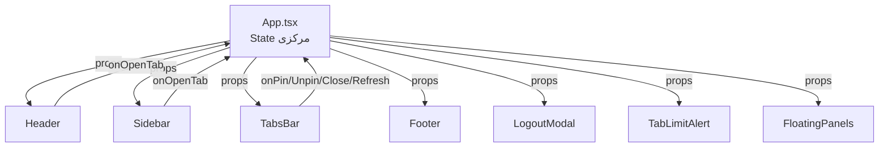

# معماری پروژه پرتال جامع دانشگاهی

## نمای کلی

پروژه **پرتال جامع دانشگاهی کارانت** یک سیستم یکپارچه مدیریت امور دانشگاهی است که با معماری **تفکیک‌شده (Decoupled)** طراحی شده است:

- **بک‌اند:** لاراول (Laravel) — ارائه APIهای REST
- **فرانت‌اند:** React + TypeScript + Vite — SPA مستقل

---

## ساختار فرانت‌اند (`portal_frontend`)

```
src/
├── api.ts                        # سرویس API (ارتباط با Laravel)
├── App.tsx                       # کامپوننت اصلی — مدیریت state مرکزی، مسیریابی، رندر ماژول‌ها
├── main.tsx                      # نقطه ورود برنامه
├── index.css                     # استایل‌های سراسری + Tailwind
├── types.ts                      # انواع و اینترفیس‌های TypeScript
├── lib/
│   ├── constants.ts              # ثابت‌های برنامه (کلیدهای localStorage، آدرس API)
│   ├── functions.ts              # توابع کمکی (API, Upload, Download, ...)
│   └── menuConfig.ts             # پیکربندی منو: انواع MenuCategory/SubmenuItem، نگاشت آیکون‌ها، توابع کمکی
├── components/
│   ├── Header.tsx                # نوار بالای پورتال (سرچ گلوبال + یوزر دراپ‌داون)
│   ├── Sidebar.tsx               # نوار کناری (منوهای دسته‌بندی + زیرمنو دراور)
│   ├── TabsBar.tsx               # نوار تب‌های بالای فضای کار (پیشخوان، تب‌ها، دکمه‌های پین/رفرش)
│   ├── Footer.tsx                # فوتر ساده
│   ├── LoginForm.tsx             # فرم ورود
│   ├── DashboardModule.tsx       # پیشخوان اصلی (Dashboard)
│   ├── ProfileModule.tsx         # پروفایل کاربر
│   ├── ChangePasswordModule.tsx  # تغییر رمز عبور
│   ├── StudentManagement.tsx     # مدیریت دانشجویان
│   ├── ProfessorManagement.tsx   # مدیریت اساتید
│   ├── FinancialManagement.tsx   # امور مالی
│   ├── ThesisManagement.tsx      # پایان‌نامه‌ها
│   ├── LegacyModules.tsx         # ماژول‌های قدیمی (Iframe)
│   ├── TutsModule.tsx            # مدیریت دوره‌های آموزشی (جایگزین CourseCoursework)
│   ├── FloatingPanels.tsx        # پنل‌های شناور (اعلان‌ها، راهنما)
│   ├── ThemeToggle.tsx           # دکمه تغییر تم (استفاده شده در Header)
│   ├── LogoutModal.tsx           # مودال تأیید خروج از حساب
│   └── TabLimitAlert.tsx         # مودال هشدار محدودیت تعداد تب‌ها
```

---

## معماری کامپوننت‌ها (Component Architecture)

### تفکیک لایه‌ها

`App.tsx` دیگر یک فایل monolithic بزرگ نیست. کد به صورت زیر تفکیک شده است:

| لایه | فایل | مسئولیت |
|------|------|----------|
| **State مرکزی** | `App.tsx` | useState, useEffect, useCallback, useMemo |
| **پیکربندی منو** | `lib/menuConfig.ts` | تایپ‌های MenuCategory/SubmenuItem، نگاشت آیکون‌ها، توابع urlToTargetId/resolveIcon |
| **نوار بالا** | `components/Header.tsx` | لوگو، سرچ گلوبال، یوزر دراپ‌داون (stateهای `menuSearchQuery` و `showUserDropdown` محلی) |
| **نوار کناری** | `components/Sidebar.tsx` | آیکون‌های دسته‌بندی + زیرمنو دراور (state `drawerSubmenuFilter` محلی) |
| **نوار تب‌ها** | `components/TabsBar.tsx` | دکمه پیشخوان + تب‌های باز + دکمه‌های پین/رفرش |
| **مودال خروج** | `components/LogoutModal.tsx` | مودال تأیید خروج |
| **مودال محدودیت تب** | `components/TabLimitAlert.tsx` | مودال هشدار پر بودن ظرفیت تب‌ها |
| **فوتر** | `components/Footer.tsx` | اطلاعات وضعیت اتصال و نسخه |

### جریان داده (Data Flow)



تمامی stateها و هندلرهای اصلی در `App.tsx` متمرکز شده‌اند و کامپوننت‌های فرزند از طریق `props` داده‌ها را دریافت و رویدادها را به `App.tsx` بازمی‌گردانند.

## مدیریت تب‌ها (Tab Management)

### موجودیت Tab

```typescript
interface Tab {
  id: string;
  title: string;
  iconName: string;
  moduleType?: string;
}
```

### حداکثر تب‌های همزمان

- **مقدار:** `MAX_TABS = 12` در `src/lib/constants.ts`
- **مکان اعمال:** تابع `handleOpenTab` در `App.tsx`
- **نحوه اعمال:** شرط `if (tabs.length >= MAX_TABS)` از ایجاد تب جدید جلوگیری می‌کند.

### حالت‌های UI مرتبط

| حالت | متغیر State | مکان UI | توضیح |
|------|-------------|---------|-------|
| نمایش هشدار محدودیت | `showLimitAlert` | `TabLimitAlert.tsx` | مودال تمام‌صفحه با پیغام هشدار |
| تأیید پاک‌سازی همه تب‌ها | `confirmClearActive` | `TabLimitAlert.tsx` | مرحله دوم تأیید برای پاک‌سازی |
| تب فعال | `activeTabId` | `TabsBar.tsx` | شناسه تب جاری |
| لیست تب‌ها | `tabs: Tab[]` | `TabsBar.tsx` | آرایه تب‌های باز |

### نوار تب‌ها (TabsBar)

کامپوننت `TabsBar.tsx` شامل سه بخش اصلی است:

1. **سمت راست (RTL):** دکمه پیشخوان اصلی + تب‌های باز شده
2. **جداکننده:** خط عمودی باریک (در صورت وجود تب)
3. **سمت چپ:** دکمه پین/لغو پین + دکمه رفرش تب فعال

### مودال هشدار محدودیت تب (TabLimitAlert)

هنگام رسیدن به حداکثر ۱۲ تب، یک مودال تمام‌صفحه با امکانات زیر نمایش داده می‌شود:

1. **آیکون هشدار** — `AlertTriangle` با انیمیشن `bounce`
2. **عنوان:** "ظرفیت تب‌های مرکز کار پر شده است!"
3. **توضیحات:** اطلاع‌رسانی درباره حداکثر ۱۲ تب همزمان
4. **دکمه پاک‌سازی همه تب‌ها** — با تأیید دو مرحله‌ای (`confirmClearActive`)
5. **دکمه بازگشت** — "متوجه شدم (بازگشت)"

### نمایش تعداد تب‌ها در DashboardModule

در پیشخوان اصلی (DashboardModule)، دو کارت نمایش داده می‌شود:

- **تب همزمان مجاز:** ۱۲ (حداکثر مجاز)
- **تب فعال فعلی:** تعداد تب‌های باز شده توسط کاربر

---

## احراز هویت

- **پکیج بک‌اند:** Laravel Fortify
- **روش:** API Token-based (Bearer Token در هدر Authorization)
- **ذخیره‌سازی توکن:** `localStorage` با کلید `portal_token`
- **ذخیره‌سازی کاربر:** `localStorage` با کلید `portal_user`

### لاگین

1. ارسال `POST /api/login` با credentials
2. دریافت `access_token` و اطلاعات کاربر
3. ذخیره در `localStorage`
4. تغییر وضعیت به `authenticated`

### خروج

1. ارسال `POST /api/logout` (حذف توکن در سرور)
2. پاک‌سازی `localStorage`
3. بازگشت به صفحه ورود

### بازیابی نشست (Session Restore)

در بارگذاری اولیه، برنامه چک می‌کند که آیا `portal_user` و `portal_token` در `localStorage` وجود دارند. در صورت وجود، کاربر مستقیماً به حالت احراز هویت شده می‌رود.

---

## تم (Theme)

- **مقادیر:** `'light' | 'dark'`
- **ذخیره‌سازی:** `localStorage` با کلید `portal_theme`
- **اعمال:** کلاس `dark` روی `<html>` برای Tailwind
- **دکمه تغییر:** کامپوننت `ThemeToggle` در Dropdown پروفایل کاربر (گوشه راست بالای هدر)

---

## API Service

### ساختار فعلی

```typescript
class ApiService {
  // استفاده از توابع API در lib/functions.ts
  async login(credentials): Promise<AuthResponse>
  async logout(): Promise<void>
  async getUser(): Promise<User>
  async updateProfile(data): Promise<User>
  async changePassword(current, new): Promise<{message}>
  async getNavigation(): Promise<NavItem[]>
  async getUserRoles(): Promise<{primary_role, all_roles}>
  async getUserPermissions(): Promise<PermissionItem[]>
  async switchRole(role): Promise<User>
  getStoredUser(): User | null
  getStoredToken(): string | null
  isAuthenticated(): boolean
  // ===== Course Module (TutsModule) =====
  async getCourses(params?): Promise<{data: Course[], meta: any}>
  async getCourse(id): Promise<Course>
  async createCourse(data): Promise<Course>
  async updateCourse(id, data): Promise<Course>
  async deleteCourse(id): Promise<void>
  async toggleCourseActive(id): Promise<Course>
  async getCourseRegistrations(courseId): Promise<CourseRegistration[]>
  async getAllRegistrations(params?): Promise<{data: CourseRegistration[], meta: any}>
  async approveReceipt(registrationId): Promise<CourseRegistration>
  async rejectReceipt(registrationId, reason?): Promise<CourseRegistration>
  async getCourseStatistics(): Promise<CourseStats>
  // ===== Surveys =====
  async getSurveys(params?): Promise<{data: CourseSurvey[], meta: any}>
  async getSurveyStatistics(): Promise<CourseSurveyStats>
  async deleteSurvey(id): Promise<void>
  // ===== Coupons/Vouchers =====
  async getCoupons(params?): Promise<{data: CourseCoupon[], meta: any}>
  async validateCoupon(code, courseId): Promise<any>
  async createCoupon(data): Promise<CourseCoupon>
  async deleteCoupon(id): Promise<void>
}
```

### توابع API در lib/functions.ts

| تابع | توضیح |
|------|-------|
| `API(URL, params, method)` | درخواست عمومی API |
| `APISendFiles(URL, formData)` | آپلود فایل با multipart/form-data |
| `downloadFile(URL, filename)` | دانلود فایل |
| `getFileViewUrl(URL)` | دریافت URL برای نمایش فایل |

---

## تغییر نقش (Role Switching)

کاربران می‌توانند بین نقش‌های خود جابجا شوند:

1. ارسال `PUT /api/user/switch-role` با نقش جدید
2. به‌روزرسانی اطلاعات کاربر
3. پاک‌سازی همه تب‌ها (برای نمایش منوهای نقش جدید)
4. دریافت مجدد منوهای ناوبری

---

## ماژول‌های قدیمی (Legacy Modules)

ماژول‌هایی که هنوز به React منتقل نشده‌اند، از طریق `<iframe>` در `LegacyModules.tsx` نمایش داده می‌شوند. آدرس این iframe‌ها از طریق API ناوبری دریافت می‌شود.

---

## ماژول دوره‌های آموزشی (TutsModule)

### معماری کلی

ماژول دوره‌های آموزشی از دو بخش اصلی تشکیل شده است:

1. **بک‌اند (Laravel):** مدل‌ها و کنترلر API برای مدیریت دوره‌ها، ثبت‌نام‌ها، نظرسنجی‌ها و بن‌های خرید
2. **فرانت‌اند (React):** کامپوننت `TutsModule.tsx` (جایگزین `CourseCoursework.tsx`) با ۶ زیرماژول مبتنی بر تب

### ساختار زیرماژول‌ها

`TutsModule` بر اساس `moduleId` از `App.tsx`، یکی از ۶ بخش زیر را نمایش می‌دهد:

| moduleId | نام فارسی | توضیح |
|----------|-----------|-------|
| `tuts-list` | فهرست دوره‌ها | نمایش گرید دوره‌ها با جستجو، دسته‌بندی، صفحه‌بندی |
| `tuts-reports` | گزارش ثبت‌نام‌ها | جدول ثبت‌نام‌ها با فیلترهای جستجو، دوره و وضعیت |
| `tuts-receipts` | بررسی فیش‌های بانکی | کارتابل تأیید/رد فیش‌های واریزی |
| `tuts-stats` | آمار و نمودارها | آمار دوره‌ها با نمودارهای Recharts |
| `tuts-surveys` | نظرسنجی‌ها | لیست نظرسنجی‌ها با جستجو و صفحه‌بندی |
| `tuts-surveys-stats` | آمار نظرسنجی‌ها | آمار و نمودارهای نتایج نظرسنجی |
| `tuts-vouchers` | بن‌های خرید | مدیریت کدهای تخفیف + شبیه‌ساز Sandbox |

### fetch تنبل (Lazy Loading)

هر زیرماژول تنها زمانی داده‌های API خود را دریافت می‌کند که کاربر برای اولین بار به آن تب مراجعه کند:

```typescript
const fetchedRef = useRef({ courses: false, registrants: false, surveys: false, vouchers: false });

useEffect(() => {
  const needsCourses = moduleId === 'tuts-list' || moduleId === 'tuts-stats' || moduleId === 'tuts-surveys';
  const needsRegistrants = moduleId === 'tuts-reports' || moduleId === 'tuts-receipts' || moduleId === 'tuts-stats';
  const needsSurveys = moduleId === 'tuts-surveys' || moduleId === 'tuts-surveys-stats';
  const needsVouchers = moduleId === 'tuts-vouchers';

  if (needsCourses && !fetchedRef.current.courses) { /* fetch courses */ }
  if (needsRegistrants && !fetchedRef.current.registrants) { /* fetch registrants */ }
  // ...
}, [moduleId]);
```

تمامی فراخوانی‌های API با `{ per_page: 1000 }` انجام می‌شود تا همه رکوردها یکجا دریافت شوند.

### صفحه‌بندی و لودینگ

هر لیست دارای صفحه‌بندی سمت کلاینت و نمایش لودینگ در زمان بارگذاری است:

| بخش | اندازه صفحه | state لودینگ |
|-----|------------|--------------|
| گرید دوره‌ها | ۱۲ | `loadingCourses` |
| جدول ثبت‌نام‌ها | ۱۵ | `loadingRegistrants` |
| لیست نظرسنجی‌ها | ۲۰ | `loadingSurveys` |
| لیست بن‌ها | ۱۰ | `loadingVouchers` |

کامپوننت `LoadingSpinner` یک SVG چرخان با متن دلخواه است.

### مدل‌های بک‌اند

#### Course (دوره آموزشی)

- **فایل:** `portal_backend/app/Models/Course.php`
- **جدول:** `courses`
- **فیلدهای اصلی:** `title`, `amount`, `active`, `image`, `description`, `syllabus`, `duration`, `instructor`, `start_date`, `end_date`, `capacity`, `registered_count`

#### Registertut (ثبت‌نام دوره)

- **فایل:** `portal_backend/app/Models/Registertut.php`
- **جدول:** `registertuts`
- **فیلدهای کلیدی:** `kodmeli`, `course_id`, `fullname`, `id_edu`, `mobile`, `email`, `payment_method`, `bank_receipt`, `verified_receipt`, `rejected_receipt`, `rejection_reason`

### کنترلر API

- **فایل:** `portal_backend/app/Http/Controllers/Api/CourseController.php`

| متد | مسیر | توضیح |
|------|------|-------|
| `index` | `GET /api/courses` | لیست دوره‌ها با فیلتر (search, active, page, per_page) |
| `show` | `GET /api/courses/{id}` | جزئیات یک دوره |
| `store` | `POST /api/courses` | ایجاد دوره جدید |
| `update` | `PUT /api/courses/{id}` | به‌روزرسانی دوره |
| `destroy` | `DELETE /api/courses/{id}` | حذف دوره |
| `registrations` | `GET /api/courses/{id}/registrations` | ثبت‌نام‌های یک دوره |
| `statistics` | `GET /api/courses/statistics` | آمار دوره‌ها |
| `approveReceipt` | `POST /api/courses/registrations/{id}/approve-receipt` | تأیید فیش |
| `rejectReceipt` | `POST /api/courses/registrations/{id}/reject-receipt` | رد فیش |

### انواع TypeScript (Frontend)

- **فایل:** `src/types.ts`
- **انواع:** `Course`, `CourseRegistration`, `CourseSurvey`, `CourseSurveyStats`, `CourseCoupon`, `CourseStats`
- **انواع محلی (Local Interfaces) در TutsModule:**
  - `TutCourse` — دوره با فیلدهای `id`, `title`, `lecturer`, `cost`, `status`, `category`, ...
  - `TutRegistrant` — ثبت‌نام با `id`, `name`, `studentCode`, `courseTitle`, `amount`, `status`, ...
  - `TutSurvey` — نظرسنجی با `id`, `name`, `phone`, `date`, `courseTitle`, `rating`, ...
  - `TutVoucher` — بن خرید با `id`, `code`, `title`, `discountPercent`, `discountAmount`, ...

### مپرها (Mappers)

داده‌های API بک‌اند قبل از ذخیره در state از طریق مپرها به انواع محلی تبدیل می‌شوند:

- `mapCourse(c)` — نگاشت `Course` به `TutCourse`
- `mapRegistrant(r)` — نگاشت `CourseRegistration` به `TutRegistrant`
- `mapVoucher(v)` — نگاشت `CourseCoupon` به `TutVoucher`

### قابلیت‌های هر زیرماژول

| زیرماژول | قابلیت‌ها |
|----------|-----------|
| **tuts-list** | گرید کارت‌ها با تصویر، جستجو، فیلتر دسته‌بندی، صفحه‌بندی، ایجاد/ویرایش/حذف دوره، فعال/غیرفعال کردن |
| **tuts-reports** | جدول ثبت‌نام‌ها با جستجو، فیلتر دوره و وضعیت، صفحه‌بندی، حذف پرونده |
| **tuts-receipts** | کارتابل بررسی فیش‌ها با دکمه‌های تأیید و رد + مودال دلیل رد |
| **tuts-stats** | کارت‌های آمار (مجموع دوره‌ها، فعال، ثبت‌نام‌ها، فیش‌های در انتظار) + نمودارهای Recharts |
| **tuts-surveys** | جدول نظرسنجی‌ها با جستجو، فیلتر تاریخ، صفحه‌بندی، حذف، نمایش جزئیات در مودال |
| **tuts-surveys-stats** | آمار تجمیعی نظرسنجی‌ها با نمودار |
| **tuts-vouchers** | لیست بن‌ها با صفحه‌بندی، فرم ایجاد بن جدید، شبیه‌ساز Sandbox برای تست قوانین تخفیف |

### رفرش تب فعال

در کامپوننت `TabsBar.tsx`، یک دکمه رفرش (`RefreshCw`) در سمت چپ نوار تب‌ها قرار دارد که با کلیک، `refreshKey` را در `App.tsx` افزایش داده و باعث ریمونت کامپوننت تب فعال می‌شود.
