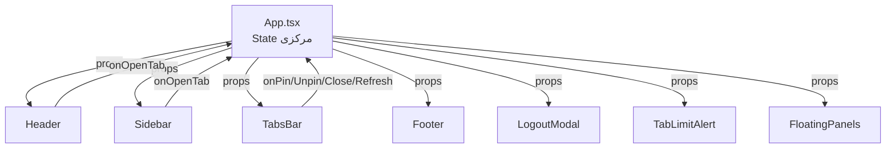

# معماری پروژه پرتال جامع دانشگاهی

## نمای کلی

پروژه **نرم‌افزار یکپارچهٔ آموزشی نیکا** یک سیستم یکپارچه مدیریت امور دانشگاهی است که با معماری **تفکیک‌شده (Decoupled)** طراحی شده است:

- **بک‌اند:** لاراول (Laravel) — ارائه APIهای REST
- **فرانت‌اند:** React + TypeScript + Vite — SPA مستقل

---

## ساختار فرانت‌اند (`portal_frontend`)

```
src/
├── api.ts                        # سرویس API (ارتباط با Laravel)
├── App.tsx                       # کامپوننت اصلی — مدیریت state مرکزی، مسیریابی، رندر ماژول‌ها
├── main.tsx                      # نقطه ورود برنامه
├── index.css                     # استایل‌های سراسری + Tailwind
├── types.ts                      # انواع و اینترفیس‌های TypeScript
├── lib/
│   ├── constants.ts              # ثابت‌های برنامه (کلیدهای localStorage، آدرس API)
│   ├── functions.ts              # توابع کمکی (API, Upload, Download, ...)
│   └── menuConfig.ts             # پیکربندی منو: انواع MenuCategory/SubmenuItem، نگاشت آیکون‌ها، توابع کمکی
├── components/
│   ├── Header.tsx                # نوار بالای پورتال (سرچ گلوبال + یوزر دراپ‌داون)
│   ├── Sidebar.tsx               # نوار کناری (منوهای دسته‌بندی + زیرمنو دراور)
│   ├── TabsBar.tsx               # نوار تب‌های بالای فضای کار (پیشخوان، تب‌ها، دکمه‌های پین/رفرش)
│   ├── Footer.tsx                # فوتر ساده
│   ├── LoginForm.tsx             # فرم ورود (طراحی شیشه‌ای مشابه دموی مرکز کارآفرینی)
│   ├── DashboardModule.tsx       # پیشخوان اصلی (Dashboard)
│   ├── ProfileModule.tsx         # پروفایل کاربر
│   ├── ChangePasswordModule.tsx  # تغییر رمز عبور
│   ├── StudentManagement.tsx     # مدیریت دانشجویان
│   ├── ProfessorManagement.tsx   # مدیریت اساتید
│   ├── FinancialManagement.tsx   # امور مالی
│   ├── ThesisManagement.tsx      # پایان‌نامه‌ها
│   ├── LegacyModules.tsx         # ماژول‌های قدیمی (Iframe)
│   ├── TutsModule.tsx            # مدیریت دوره‌های آموزشی (کامپوننت اصلی – فاقد آمار بنری بالای صفحه) |
│   ├── tuts/                     # زیرماژول‌های استخراج‌شده از TutsModule
│   │   ├── tuts-types.ts         # انواع مشترک TypeScript (TutCourse, TutRegistrant, ...)
│   │   ├── tuts-utils.ts         # توابع کمکی (toPersianDigits, formatCurrency, mapCourse, ...)
│   │   ├── tuts-hooks.ts         # هوک‌های سفارشی (useToast, useTutsData, useCourseCRUD, ...)
│   │   ├── tuts-components.tsx   # کامپوننت‌های کوچک اشتراکی (LoadingSpinner)
│   │   ├── TutsCourseList.tsx    # فهرست دوره‌ها (گرید، جستجو، فیلتر، صفحه‌بندی، CRUD)
│   │   ├── TutsReports.tsx       # گزارش ثبت‌نام‌ها
│   │   ├── TutsReceipts.tsx      # بررسی فیش‌های بانکی
│   │   ├── TutsStats.tsx         # آمار و نمودارها (Recharts)
│   │   ├── TutsSurveys.tsx       # نظرسنجی‌ها
│   │   ├── TutsSurveysStats.tsx  # آمار نظرسنجی‌ها
│   │   ├── TutsVouchers.tsx      # بن‌های خرید تخفیف
│   │   └── TutsModals.tsx        # مودال‌های اشتراکی (مدیریت گروه‌ها + تأیید حذف)
│   ├── FloatingPanels.tsx        # پنل‌های شناور (اعلان‌ها، راهنما)
│   ├── ThemeToggle.tsx           # دکمه تغییر تم (استفاده شده در Header)
│   ├── LogoutModal.tsx           # مودال تأیید خروج از حساب
│   ├── TabLimitAlert.tsx         # مودال هشدار محدودیت تعداد تب‌ها
│   └── SessionWarningModal.tsx   # مودال هشدار نشست موازی (نمایش مشخصات دستگاه)
```

---

## معماری کامپوننت‌ها (Component Architecture)

### تفکیک لایه‌ها

`App.tsx` دیگر یک فایل monolithic بزرگ نیست. کد به صورت زیر تفکیک شده است:

| لایه | فایل | مسئولیت |
|------|------|----------|
| **State مرکزی** | `App.tsx` | useState, useEffect, useCallback, useMemo |
| **پیکربندی منو** | `lib/menuConfig.ts` | تایپ‌های MenuCategory/SubmenuItem، نگاشت آیکون‌ها، توابع urlToTargetId/resolveIcon |
| **نوار بالا** | `components/Header.tsx` | لوگو، سرچ گلوبال، یوزر دراپ‌داون (stateهای `menuSearchQuery` و `showUserDropdown` محلی) |
| **نوار کناری** | `components/Sidebar.tsx` | آیکون‌های دسته‌بندی + زیرمنو دراور (state `drawerSubmenuFilter` محلی) |
| **نوار تب‌ها** | `components/TabsBar.tsx` | دکمه پیشخوان + تب‌های باز + دکمه‌های پین/رفرش |
| **مودال خروج** | `components/LogoutModal.tsx` | مودال تأیید خروج |
| **مودال محدودیت تب** | `components/TabLimitAlert.tsx` | مودال هشدار پر بودن ظرفیت تب‌ها |
| **مودال هشدار نشست موازی** | `components/SessionWarningModal.tsx` | مودال هشدار نشست موازی (نمایش IP، مرورگر، سیستم‌عامل، وضوح صفحه، پلتفرم، زبان، منطقه زمانی دستگاه متقاضی) |
| **فوتر** | `components/Footer.tsx` | اطلاعات وضعیت اتصال و نسخه |

### جریان داده (Data Flow)



تمامی stateها و هندلرهای اصلی در `App.tsx` متمرکز شده‌اند و کامپوننت‌های فرزند از طریق `props` داده‌ها را دریافت و رویدادها را به `App.tsx` بازمی‌گردانند.

## مدیریت تب‌ها (Tab Management)

### موجودیت Tab

```typescript
interface Tab {
  id: string;
  title: string;
  iconName: string;
  moduleType?: string;
}
```

### حداکثر تب‌های همزمان

- **مقدار:** `MAX_TABS = 12` در `src/lib/constants.ts`
- **مکان اعمال:** تابع `handleOpenTab` در `App.tsx`
- **نحوه اعمال:** شرط `if (tabs.length >= MAX_TABS)` از ایجاد تب جدید جلوگیری می‌کند.

### حالت‌های UI مرتبط

| حالت | متغیر State | مکان UI | توضیح |
|------|-------------|---------|-------|
| نمایش هشدار محدودیت | `showLimitAlert` | `TabLimitAlert.tsx` | مودال تمام‌صفحه با پیغام هشدار |
| تأیید پاک‌سازی همه تب‌ها | `confirmClearActive` | `TabLimitAlert.tsx` | مرحله دوم تأیید برای پاک‌سازی |
| تب فعال | `activeTabId` | `TabsBar.tsx` | شناسه تب جاری |
| لیست تب‌ها | `tabs: Tab[]` | `TabsBar.tsx` | آرایه تب‌های باز |

### نوار تب‌ها (TabsBar)

کامپوننت `TabsBar.tsx` شامل سه بخش اصلی است:

1. **سمت راست (RTL):** دکمه پیشخوان اصلی + تب‌های باز شده
2. **جداکننده:** خط عمودی باریک (در صورت وجود تب)
3. **سمت چپ:** دکمه پین/لغو پین + دکمه رفرش تب فعال

### مودال هشدار محدودیت تب (TabLimitAlert)

هنگام رسیدن به حداکثر ۱۲ تب، یک مودال تمام‌صفحه با امکانات زیر نمایش داده می‌شود:

1. **آیکون هشدار** — `AlertTriangle` با انیمیشن `bounce`
2. **عنوان:** "ظرفیت تب‌های مرکز کار پر شده است!"
3. **توضیحات:** اطلاع‌رسانی درباره حداکثر ۱۲ تب همزمان
4. **دکمه پاک‌سازی همه تب‌ها** — با تأیید دو مرحله‌ای (`confirmClearActive`)
5. **دکمه بازگشت** — "متوجه شدم (بازگشت)"

### نمایش تعداد تب‌ها در DashboardModule

در پیشخوان اصلی (DashboardModule)، دو کارت نمایش داده می‌شود:

- **تب همزمان مجاز:** ۱۲ (حداکثر مجاز)
- **تب فعال فعلی:** تعداد تب‌های باز شده توسط کاربر

---

## احراز هویت

- **پکیج بک‌اند:** Laravel Fortify
- **روش:** API Token-based (Bearer Token در هدر Authorization)
- **ذخیره‌سازی توکن:** `localStorage` با کلید `portal_token`
- **ذخیره‌سازی کاربر:** `localStorage` با کلید `portal_user`

### لاگین

1. ارسال `POST /api/login` با credentials
2. در صورت موفقیت: دریافت `access_token` و اطلاعات کاربر ← ذخیره در `localStorage` ← تغییر وضعیت به `authenticated`
3. در صورت نشست هم‌زمان (کد 409): دریافت `warning_id` و `poll_token` ← نمایش دیالوگ ۳ دکمه‌ای با گزینه‌های:
   - **ادامه و باطل کردن نشست قبلی** (force login)
   - **ادامه با هشدار به نشست موازی** (ایجاد هشدار + ذخیره اطلاعات دستگاه)
   - **انصراف** (بازگشت به فرم لاگین)

### نشست هم‌زمان (Concurrent Login Detection)

هنگامی که کاربری با یک حساب کاربری در حالی لاگین می‌کند که نشست فعال دیگری از همان کاربر وجود دارد، بک‌اند کد 409 را همراه با `warning_id` و `poll_token` برمی‌گرداند. در این حالت:

1. **دیالوگ ۳ دکمه‌ای** در `LoginForm.tsx` نمایش داده می‌شود:
   - **"ادامه و باطل کردن نشست قبلی"** — فراخوانی `forceLogin()` در بک‌اند که نشست قبلی را باطل و نشست جدید را فعال می‌کند
   - **"ادامه با هشدار به نشست موازی"** — ایجاد یک هشدار در `session_warnings` با ذخیره اطلاعات دستگاه (IP، User-Agent، Browser Fingerprint) و ادامه لاگین بدون باطل کردن نشست قبلی. کاربر دوم می‌تواند هم‌زمان با کاربر اول از سیستم استفاده کند
   - **"انصراف"** — بازگشت به فرم لاگین

2. **مودال هشدار نشست موازی (SessionWarningModal):** در `App.tsx` یک Polling با بازه ۱۰ ثانیه فعال است که `getPendingWarnings()` را صدا می‌زند. اگر هشدار جدیدی وجود داشته باشد، مودال با اطلاعات دستگاه (IP، مرورگر، سیستم‌عامل، وضوح صفحه، پلتفرم، زبان، منطقه زمانی) نمایش داده می‌شود. کاربر می‌تواند:
   - **"بستن نشست متقاضی"** — ارسال `respondToWarning(warning.id, 'denied')` که نشست کاربر متقاضی را قطع می‌کند
   - **"فعلاً بعداً تصمیم می‌گیرم"** — بستن مودال (هشدار در وضعیت در انتظار باقی می‌ماند)

3. **Browser Fingerprint:** تابع `getBrowserFingerprint()` در `lib/functions.ts` یک JSON از ۱۵+ مشخصه دستگاه شامل وضوح صفحه، منطقه زمانی، platform، `hardwareConcurrency` و ... تولید می‌کند. این مقدار در درخواست `createSessionWarning` به بک‌اند ارسال و در جدول `session_warnings` ذخیره می‌شود.

### طراحی فرم لاگین

فرم لاگین (`LoginForm.tsx`) با رنگ‌بندی برند اصلی نرم‌افزار **نیکا** (سبز فیروزه‌ای) طراحی شده است:

- **چیدمان:** دو پنل مساوی (`lg:grid-cols-12` با تقسیم ۶/۶) در یک گرید کنار هم
- **پنل راست (معرفی — سبز):**
  - پس‌زمینه: گرادینت سبز فیروزه‌ای (`#0d9488` → `#115e59` → `#134e4a`)
  - تایپوگرافی سفید با رنگ‌های فیروزه‌ای ملایم (teal-100, teal-200, teal-300)
  - المان‌های تزئینی: دایره‌های محو (blur-3xl) به‌رنگ‌های teal-400 و emerald-500
- **پنل چپ (فرم — سفید):**
  - پس‌زمینه: سفید خالص (`bg-white`)
  - کارد فرم: سفید با سایه (`shadow-xl border border-gray-100`)
  - رنگ‌های اصلی:
    - سبز فیروزه‌ای (`#0d9488` / teal-600) — رنگ اصلی برند (دکمه ورود، لینک‌ها)
    - تیره دودی — برای تایپوگرافی (متن‌ها، برچسب‌ها)
    - خاکستری — برای حاشیه‌ها و متن کم‌رنگ
  - اینپوت‌ها: `bg-white` با حاشیه `border-gray-300` و فوکس `ring-teal-500`
  - لوگو: تصویر `logo_nika.png` بدون فیلتر (روی پس‌زمینه سفید)
- **المان‌های تزئینی:** اشکال SVG انتزاعی و دایره‌های محو (blur) در پنل راست
- **حالت تاریک:** پس‌زمینه گرادینت ثابت (عدم استفاده از تم تیره مجزا)

### خروج

1. ارسال `POST /api/logout` (حذف توکن در سرور)
2. پاک‌سازی `localStorage`
3. بازگشت به صفحه ورود

### بازیابی نشست (Session Restore)

در بارگذاری اولیه، برنامه چک می‌کند که آیا `portal_user` و `portal_token` در `localStorage` وجود دارند. در صورت وجود، کاربر مستقیماً به حالت احراز هویت شده می‌رود.

---

## تم (Theme)

- **مقادیر:** `'light' | 'dark'`
- **ذخیره‌سازی:** `localStorage` با کلید `portal_theme`
- **ذخیره در سرور:** `PUT /api/user/theme` — همزمان با تغییر تم، مقدار آن در پروفایل کاربر ذخیره می‌شود (با گارد `viewState === 'authenticated'`)
- **اعمال:** کلاس `dark` روی `<html>` برای Tailwind
- **دکمه تغییر:** کامپوننت `ThemeToggle` در Dropdown پروفایل کاربر (گوشه راست بالای هدر)

---

## API Service

### ساختار فعلی

```typescript
class ApiService {
  // استفاده از توابع API در lib/functions.ts
  async login(credentials): Promise<AuthResponse>
  async logout(): Promise<void>
  async getUser(): Promise<User>
  async updateProfile(data): Promise<User>
  async changePassword(current, new): Promise<{message}>
  async getNavigation(): Promise<NavItem[]>
  async getUserRoles(): Promise<{primary_role, all_roles}>
  async getUserPermissions(): Promise<PermissionItem[]>
  async switchRole(role): Promise<User>
  // ===== Theme =====
  async updateTheme(theme): Promise<void>
  // ===== Course Groups =====
  async getCourseGroups(): Promise<CourseGroup[]>
  async createCourseGroup(title): Promise<CourseGroup>
  async updateCourseGroup(id, title): Promise<CourseGroup>
  async deleteCourseGroup(id): Promise<void>
  getStoredUser(): User | null
  getStoredToken(): string | null
  isAuthenticated(): boolean
  // ===== Course Module (TutsModule) =====
  async getCourses(params?): Promise<{data: Course[], meta: any}>
  async getCourse(id): Promise<Course>
  async createCourse(data): Promise<Course>
  async updateCourse(id, data): Promise<Course>
  async deleteCourse(id): Promise<void>
  async toggleCourseActive(id): Promise<Course>
  async getCourseRegistrations(courseId): Promise<CourseRegistration[]>
  async getAllRegistrations(params?): Promise<{data: CourseRegistration[], meta: any}>
  async approveReceipt(registrationId): Promise<CourseRegistration>
  async rejectReceipt(registrationId, reason?): Promise<CourseRegistration>
  async getCourseStatistics(): Promise<CourseStats>
  async getDetailedCourseStatistics(params?): Promise<DetailedCourseStats>
  // ===== Surveys =====
  async getSurveys(params?): Promise<{data: CourseSurvey[], meta: any}>
  async getSurveyStatistics(): Promise<CourseSurveyStats>
  async deleteSurvey(id): Promise<void>
  // ===== Coupons/Vouchers =====
  async getCoupons(params?): Promise<{data: CourseCoupon[], meta: any}>
  async validateCoupon(code, courseId): Promise<any>
  async createCoupon(data): Promise<CourseCoupon>
  async deleteCoupon(id): Promise<void>
  // ===== Certificates =====
  async getCertificateRegistrations(params?): Promise<{data: any[], meta: any}>
  async approveCertificate(registerId): Promise<any>
  async rejectCertificate(registerId): Promise<any>
  async approveAllCertificates(courseId): Promise<any>
  async downloadAllCertificates(courseId?): Promise<Blob>

  // ===== Session Warnings =====
  async createSessionWarning(username, password, browserFingerprint?): Promise<{warning_id, poll_token}>
  async getPendingWarnings(): Promise<{id, ip_address, user_agent, browser_fingerprint}[]>
  async checkSessionWarningStatus(id): Promise<{status}>
  async respondToWarning(id, response): Promise<void>

  // (generateCertificate حذف شده — دانلود مستقیم با window.open به مسیر عمومی وب)
  // (downloadFromPublicRoute حذف شده — دانلود با window.open)
}
```

### توابع API در lib/functions.ts

| تابع | توضیح |
|------|-------|
| `API(URL, params, method)` | درخواست عمومی API |
| `APISendFiles(URL, formData)` | آپلود فایل با multipart/form-data |
| `downloadFile(URL, filename)` | دانلود فایل |
| `getFileViewUrl(URL)` | دریافت URL برای نمایش فایل |
| `getBrowserFingerprint()` | جمع‌آوری اثر انگشت مرورگر (وضوح صفحه، colorDepth، pixelRatio، منطقه زمانی، زبان، پلتفرم، hardwareConcurrency، deviceMemory، cookieEnabled، doNotTrack، maxTouchPoints، vendor، productSub) به صورت JSON |

> `downloadFromPublicRoute()` حذف شده — دانلود گواهی با `window.open()` مستقیم به مسیر عمومی وب انجام می‌شود.

---

## تغییر نقش (Role Switching)

کاربران می‌توانند بین نقش‌های خود جابجا شوند:

1. ارسال `PUT /api/user/switch-role` با نقش جدید
2. به‌روزرسانی اطلاعات کاربر
3. پاک‌سازی همه تب‌ها (برای نمایش منوهای نقش جدید)
4. دریافت مجدد منوهای ناوبری

---

## ماژول‌های قدیمی (Legacy Modules)

ماژول‌هایی که هنوز به React منتقل نشده‌اند، از طریق `<iframe>` در `LegacyModules.tsx` نمایش داده می‌شوند. آدرس این iframe‌ها از طریق API ناوبری دریافت می‌شود.

---

## ماژول دوره‌های آموزشی (TutsModule)

### معماری کلی

ماژول دوره‌های آموزشی از دو بخش اصلی تشکیل شده است:

1. **بک‌اند (Laravel):** مدل‌ها و کنترلر API برای مدیریت دوره‌ها، ثبت‌نام‌ها، نظرسنجی‌ها و بن‌های خرید
2. **فرانت‌اند (React):** کامپوننت `TutsModule.tsx` (جایگزین `CourseCoursework.tsx`) با ۷ زیرماژول

### بازمعماری (Refactoring) — استخراج زیرماژول‌ها

فایل `TutsModule.tsx` در اصل یک فایل monolithic با حدود **۵۱۶۰ خط** بود که در یک بازمعماری اساسی به چندین فایل کوچک تفکیک شد:

| فایل اصلی | خطوط | فایل‌های استخراج‌شده | خطوط جدید |
|-----------|------|----------------------|-----------|
| `TutsModule.tsx` | ~5160 | `TutsModule.tsx` + 11 فایل در `tuts/` | ~2735 (کامپوننت اصلی) |

#### ساختار پوشه `tuts/`

```
src/components/tuts/
├── tuts-types.ts           # انواع مشترک TypeScript
│                            #   TutCourse, TutRegistrant, TutSurvey, TutVoucher,
│                            #   VoucherFormData, SandboxResult, TutsModuleProps, ...
├── tuts-utils.ts           # توابع کمکی اشتراکی
│                            #   toPersianDigits(), formatCurrency(),
│                            #   mapCourse(), mapRegistrant(), mapVoucher()
├── tuts-hooks.ts           # هوک‌های سفارشی React
│                            #   useToast, useTutsData, useCourseCRUD,
│                            #   useVoucherOps, usePreRegistration, useSurveyOps,
│                            #   useReceiptOps, usePagination, useStatsFilter
├── tuts-components.tsx     # کامپوننت‌های کوچک اشتراکی
│                            #   LoadingSpinner (SVG چرخان با متن دلخواه)
├── TutsCourseList.tsx      # زیرماژول ۱ — فهرست دوره‌ها (گرید، جستجو، فیلتر،
│                            #   صفحه‌بندی، دیالوگ آمار ۱۳-ستونی، ایجاد/ویرایش/حذف،
│                            #   پیش‌ثبت‌نام)
├── TutsReports.tsx         # زیرماژول ۲ — گزارش ثبت‌نام‌ها (فیلتر، جدول ۱۳-ستونی،
│                            #   صفحه‌بندی، حذف پرونده)
├── TutsReceipts.tsx        # زیرماژول ۳ — بررسی فیش‌های بانکی (کارتابل تأیید/رد،
│                            #   مودال دلیل رد)
├── TutsStats.tsx           # زیرماژول ۴ — آمار و نمودارها (AreaChart با Recharts،
│                            #   کارت‌های KPI، تفکیک فصلی)
├── TutsSurveys.tsx         # زیرماژول ۵ — نظرسنجی‌ها (لیست، جستجو، فیلتر تاریخ،
│                            #   صفحه‌بندی، مودال جزئیات)
├── TutsSurveysStats.tsx    # زیرماژول ۶ — آمار نظرسنجی‌ها (امتیاز ستاره‌ای،
│                            #   تفکیک ۴ بُعدی کیفیت)
├── TutsVouchers.tsx        # زیرماژول ۷ — بن‌های خرید (لیست، ایجاد،
│                            #   شبیه‌ساز Sandbox)
└── TutsModals.tsx          # مودال‌های اشتراکی سراسری
                             #   CategoryManager (مدیریت گروه‌های آموزشی)
                             #   DeleteConfirmModal (تأیید حذف)
```

### صدور و پیش‌نمایش گواهی دوره (Certificate System)

سیستم صدور گواهی دوره‌های آموزشی از دو بخش تشکیل شده است:

1. **دیالوگ پیش‌نمایش گواهی** — یک مودال تمام‌صفحه با سه حالت (لودینگ / نمایش PDF در `<iframe>` / خطا). گواهی مستقیماً از مسیر عمومی وب `/certificate/preview/{encryptedId}` لود می‌شود. دکمه دانلود با لینک `/certificate/{encryptedId}`.
2. **مدیریت صدور گواهی در جدول جزئیات دوره** — در دیالوگ آمار دوره، یک ستون **عملیات گواهی** (فقط ادمین) با دکمه‌های:
   - **تأیید گواهی** (`CheckCircle`) — تأیید پیش‌ثبت‌نام برای صدور گواهی
   - **لغو** (`XCircle`) — لغو تأیید صدور گواهی
   - **پیش نمایش مدرک** (`Eye`) — نمایش گواهی در دیالوگ پیش‌نمایش (زمانی که هنوز گواهی صادر نشده)
   - **دانلود / پیش‌نمایش** — آیکون‌های مجزا بعد از صدور گواهی

**نوار مدیریت صدور گواهی** (فقط ادمین):
- دکمه "تأیید همه برای صدور گواهی" — تأیید یکباره همه ثبت‌نام‌کنندگان تأییدشده یک دوره
- دکمه "دانلود همه گواهی‌ها" — دریافت فایل ZIP شامل تمام گواهی‌های صادرشده

**مسیرهای عمومی (web.php):**
| مسیر | توضیح |
|------|-------|
| `GET /certificate/{encryptedId}` | دانلود مستقیم PDF گواهی (عمومی) |
| `GET /certificate/preview/{encryptedId}` | نمایش گواهی در iframe (عمومی) |

**مسیرهای API (محافظت‌شده):**
| متد | مسیر | توضیح |
|-----|------|-------|
| GET | `/api/certificates` | لیست ثبت‌نام‌های قابل صدور گواهی با فیلتر |
| POST | `/api/certificates/approve/{registerId}` | تأیید یک ثبت‌نام برای صدور گواهی |
| POST | `/api/certificates/reject/{registerId}` | لغو تأیید صدور گواهی |
| POST | `/api/certificates/approve-all` | تأیید همه ثبت‌نام‌های یک دوره |
| GET | `/api/certificates/download-all` | دانلود ZIP همه گواهی‌ها |

> **نکته:** مسیرهای `generate` و `preview` از `api.php` به `web.php` منتقل شده‌اند و دیگر احراز هویت ندارند. دانلود با `window.open()` به جای `fetch()` انجام می‌شود (عدم نیاز به CORS). پیش‌نمایش در iframe با استفاده از Vite proxy در محیط توسعه (مسیر نسبی `/certificate/preview/{id}`) انجام می‌شود تا مشکل CORS و Content Blocking مرورگر برطرف شود.

### معماری رندر (ModuleId Gating)

`TutsModule.tsx` بر اساس `moduleId` از `App.tsx`، تنها یکی از زیرماژول‌ها را رندر می‌کند. برخلاف معماری قبلی که همه زیرماژول‌ها را هم‌زمان نشان می‌داد (`display: none`)، اکنون هر زیرماژول با شرط `{moduleId === '...' && (...)}` رندر می‌شود:

```typescript
export default function TutsModule({ user, activeTabId, moduleId, onOpenTab }: TutsModuleProps) {
  // stateهای اشتراکی (دوره‌ها، ثبت‌نام‌ها، گروه‌ها، ...)
  // ...

  return (
    <div className="...">
      {/* هدر و آمار همیشه نمایش داده می‌شود */}
      <StatsBanner />

      {/* فقط زیرماژول منطبق با moduleId رندر می‌شود */}
      {moduleId === 'tuts-list' && (
        <TutsCourseList ... />
        <TutsModals ... />  {/* مودال‌های گروه و حذف */}
      )}
      {moduleId === 'tuts-reports' && <TutsReports ... />}
      {moduleId === 'tuts-receipts' && <TutsReceipts ... />}
      {moduleId === 'tuts-stats' && <TutsStats ... />}
      {moduleId === 'tuts-surveys' && <TutsSurveys ... />}
      {moduleId === 'tuts-surveys-stats' && <TutsSurveysStats ... />}
      {moduleId === 'tuts-vouchers' && <TutsVouchers ... />}
    </div>
  );
}
```

### ساختار زیرماژول‌ها

`TutsModule` بر اساس `moduleId` از `App.tsx`، یکی از ۷ بخش زیر را نمایش می‌دهد:

| moduleId | نام فارسی | کامپوننت | توضیح |
|----------|-----------|----------|-------|
| `tuts-list` | فهرست دوره‌ها | `TutsCourseList` | گرید دوره‌ها با جستجو، دسته‌بندی، صفحه‌بندی، CRUD |
| `tuts-reports` | گزارش ثبت‌نام‌ها | `TutsReports` | جدول ثبت‌نام‌ها با فیلتر و صفحه‌بندی |
| `tuts-receipts` | بررسی فیش‌های بانکی | `TutsReceipts` | کارتابل تأیید/رد فیش‌های واریزی |
| `tuts-stats` | آمار و نمودارها | `TutsStats` | آمار دوره‌ها با نمودارهای Recharts |
| `tuts-surveys` | نظرسنجی‌ها | `TutsSurveys` | لیست نظرسنجی‌ها با جستجو و صفحه‌بندی |
| `tuts-surveys-stats` | آمار نظرسنجی‌ها | `TutsSurveysStats` | آمار و نمودارهای نتایج نظرسنجی |
| `tuts-vouchers` | بن‌های خرید | `TutsVouchers` | مدیریت کدهای تخفیف + شبیه‌ساز Sandbox |

### نگاشت moduleId در App.tsx

ماژول `TutsModule` با چندین `moduleId` مختلف در `App.tsx` تطبیق داده می‌شود:

```typescript
// در renderModuleForTab داخل App.tsx
case 'tuts':
case 'tuts-list':
case 'tuts-reports':
case 'tuts-receipts':
case 'tuts-stats':
case 'tuts-surveys':
case 'tuts-surveys-stats':
case 'tuts-vouchers':
case 'tuts/reports':
case 'tuts/bank-receipts':
case 'tuts/statistics':
case 'course-surveys':
case 'course-surveys/statistics':
  return <TutsModule moduleId={...} ... />;
```

### fetch تنبل (Lazy Loading)

هر زیرماژول تنها زمانی داده‌های API خود را دریافت می‌کند که کاربر برای اولین بار به آن تب مراجعه کند:

```typescript
const fetchedRef = useRef({ courses: false, registrants: false, surveys: false, vouchers: false });

useEffect(() => {
  const needsCourses = moduleId === 'tuts-list' || moduleId === 'tuts-stats' || moduleId === 'tuts-surveys';
  const needsRegistrants = moduleId === 'tuts-reports' || moduleId === 'tuts-receipts' || moduleId === 'tuts-stats';
  const needsSurveys = moduleId === 'tuts-surveys' || moduleId === 'tuts-surveys-stats';
  const needsVouchers = moduleId === 'tuts-vouchers';

  if (needsCourses && !fetchedRef.current.courses) { /* fetch courses */ }
  if (needsRegistrants && !fetchedRef.current.registrants) { /* fetch registrants */ }
  // ...
}, [moduleId]);
```

تمامی فراخوانی‌های API با `{ per_page: 1000 }` انجام می‌شود تا همه رکوردها یکجا دریافت شوند.

### صفحه‌بندی و لودینگ

هر لیست دارای صفحه‌بندی سمت کلاینت و نمایش لودینگ در زمان بارگذاری است:

| بخش | اندازه صفحه | state لودینگ |
|-----|------------|--------------|
| گرید دوره‌ها | ۱۲ | `loadingCourses` |
| جدول ثبت‌نام‌ها | ۱۵ | `loadingRegistrants` |
| لیست نظرسنجی‌ها | ۲۰ | `loadingSurveys` |
| لیست بن‌ها | ۱۰ | `loadingVouchers` |

کامپوننت `LoadingSpinner` در `tuts-components.tsx` یک SVG چرخان با متن دلخواه است.

### مدل‌های بک‌اند

#### Course (دوره آموزشی)

- **فایل:** `portal_backend/app/Models/Course.php`
- **جدول:** `courses`
- **فیلدهای اصلی:** `title`, `amount`, `active`, `image`, `description`, `syllabus`, `duration`, `instructor`, `start_date`, `end_date`, `capacity`, `registered_count`

#### Registertut (ثبت‌نام دوره)

- **فایل:** `portal_backend/app/Models/Registertut.php`
- **جدول:** `registertuts`
- **فیلدهای کلیدی:** `kodmeli`, `course_id`, `fullname`, `id_edu`, `mobile`, `email`, `payment_method`, `bank_receipt`, `verified_receipt`, `rejected_receipt`, `rejection_reason`

### کنترلر API

- **فایل:** `portal_backend/app/Http/Controllers/Api/CourseController.php`

| متد | مسیر | توضیح |
|------|------|-------|
| `index` | `GET /api/courses` | لیست دوره‌ها با فیلتر (search, active, page, per_page) |
| `show` | `GET /api/courses/{id}` | جزئیات یک دوره |
| `store` | `POST /api/courses` | ایجاد دوره جدید |
| `update` | `PUT /api/courses/{id}` | به‌روزرسانی دوره |
| `destroy` | `DELETE /api/courses/{id}` | حذف دوره |
| `registrations` | `GET /api/courses/{id}/registrations` | ثبت‌نام‌های یک دوره |
| `statistics` | `GET /api/courses/statistics` | آمار دوره‌ها |
| `approveReceipt` | `POST /api/courses/registrations/{id}/approve-receipt` | تأیید فیش |
| `rejectReceipt` | `POST /api/courses/registrations/{id}/reject-receipt` | رد فیش |

### انواع TypeScript (Frontend)

- **فایل اصلی:** `src/types.ts` — انواع API بک‌اند (`Course`, `CourseRegistration`, `CourseSurvey`, `CourseSurveyStats`, `CourseCoupon`, `CourseStats`, `CourseGroup`)
- **فایل محلی ماژول:** `src/components/tuts/tuts-types.ts` — انواع داخلی زیرماژول‌ها:
  - `TutsModuleProps` — props ورودی کامپوننت اصلی
  - `TutCourse` — دوره با فیلدهای `id`, `title`, `lecturer`, `cost`, `status`, `category`, ...
  - `TutRegistrant` — ثبت‌نام با `id`, `name`, `nationalCode`, `studentCode`, `mobile`, `typeText`, `courseId`, `courseTitle`, `date`, `verifiedAt`, `amount`, `paymentMethod`, `trackingCode`, `bankReceipt`, `status`, `certificateApproved`, `certificateNumber`, `certificateIssuedAt`, `hasCertificate`
  - `TutSurvey` — نظرسنجی با `courseId`, `courseTitle`, `rating`, `totalResponses`, `breakdown`, ...
  - `TutVoucher` — بن خرید با `id`, `code`, `title`, `discountType`, `discountValue`, `globalCap`, `totalUsed`, `validFrom`, `validTo`, `courseId`, `minCoursePrice`, `budgetCap`, ... و ۳۰+ فیلد دیگر
  - `VoucherFormData` — داده‌های فرم ایجاد بن جدید
  - `SandboxResult` — نتیجه شبیه‌ساز با `isValid`, `error`, `discountAmount`, `finalPrice`, `originalPrice`, `allowInstallments`, `checks[]`, `breakdown`

### مپرها (Mappers)

داده‌های API بک‌اند قبل از ذخیره در state از طریق مپرها به انواع محلی تبدیل می‌شوند. مپرها در `src/components/tuts/tuts-utils.ts` تعریف شده‌اند:

- `mapCourse(c)` — نگاشت `Course` به `TutCourse` (از `c.group_title` برای فیلد `category` استفاده می‌کند)
- `mapRegistrant(r)` — نگاشت `CourseRegistration` به `TutRegistrant`
- `mapVoucher(v)` — نگاشت `CourseCoupon` به `TutVoucher`

### قابلیت‌های هر زیرماژول

| زیرماژول | کامپوننت | قابلیت‌ها |
|----------|----------|-----------|
| **tuts-list** | `TutsCourseList.tsx` | گرید کارت‌ها با تصویر، جستجو، فیلتر دسته‌بندی، صفحه‌بندی، ایجاد/ویرایش/حذف دوره، فعال/غیرفعال کردن، دیالوگ آمار و جزئیات با جدول ۷-ستونی (کد ملی، نام، شماره دانشجویی، موبایل، نوع کاربر، تاریخ ثبت‌نام، عملیات گواهی برای ادمین) — فقط ثبت‌نام‌کنندگان با وضعیت **تایید نهایی** نمایش داده می‌شوند + اسکرول مستقل، پیش‌ثبت‌نام |
| **tuts-reports** | `TutsReports.tsx` | جدول ثبت‌نام‌ها با جستجو، فیلتر دوره و وضعیت، صفحه‌بندی، حذف پرونده |
| **tuts-receipts** | `TutsReceipts.tsx` | کارتابل بررسی فیش‌ها با دکمه‌های تأیید و رد + مودال دلیل رد |
| **tuts-stats** | `TutsStats.tsx` | کارت‌های آمار (مجموع دوره‌ها، فعال، ثبت‌نام‌ها، فیش‌های در انتظار) + نمودار AreaChart با Recharts، تفکیک فصلی |
| **tuts-surveys** | `TutsSurveys.tsx` | جدول نظرسنجی‌ها با جستجو، فیلتر تاریخ، صفحه‌بندی، حذف، نمایش جزئیات در مودال |
| **tuts-surveys-stats** | `TutsSurveysStats.tsx` | آمار تجمیعی نظرسنجی‌ها با امتیاز ستاره‌ای، تفکیک ۴ بُعدی (محتوا، مدرس، سازمان، امکانات) |
| **tuts-vouchers** | `TutsVouchers.tsx` | لیست بن‌ها با صفحه‌بندی، فرم ایجاد بن جدید با گزینه‌های زمانی/محصولی/مصرفی، شبیه‌ساز Sandbox برای تست قوانین تخفیف با ۸+ شرط |

### رفرش تب فعال

در کامپوننت `TabsBar.tsx`، یک دکمه رفرش (`RefreshCw`) در سمت چپ نوار تب‌ها قرار دارد.

**سازوکار (پس از فاز ۱۲):** هر تب دارای `tabRefreshKeys[tabId]` مستقل است. با کلیک روی دکمه رفرش، فقط کلید تب فعال افزایش می‌یابد → فقط همان تب ریمونت می‌شود (سایر تب‌ها و پیشخوان دست نخورده باقی می‌مانند).

```typescript
const [tabRefreshKeys, setTabRefreshKeys] = useState<Record<string, number>>({});

const handleRefreshTab = useCallback(() => {
  if (activeTabId) {
    setTabRefreshKeys(prev => ({
      ...prev,
      [activeTabId]: (prev[activeTabId] || 0) + 1,
    }));
  }
}, [activeTabId]);
```

### مدیریت گروه‌های آموزشی (Course Groups)

مدیریت دسته‌بندی دوره‌های آموزشی از طریق **گروه‌های آموزشی** با همگام‌سازی با سرور انجام می‌شود:

**بک‌اند:**
- **مدل:** `CourseGroup` در `app/Models/CourseGroup.php` — فیلدهای `id`, `title`
- **کنترلر:** `CourseGroupController` با ۴ متد CRUD
- **روت‌ها:** `GET/POST /api/course-groups` و `PUT/DELETE /api/course-groups/{id}`
- **ارتباط:** مدل `Course` دارای `group_id` (FK → course_groups.id) و متد `group()`

**فرانت‌اند (TutsModals.tsx):**
- **مودال CategoryManager:** مدیریت گروه‌های آموزشی در یک مودال اختصاصی
- **State:** `courseGroups` (آیتم‌های `{id, title}` از سرور) + `categories` (رشته‌های عنوان) + `categoriesLoading`
- **بارگذاری:** `useEffect` در زمان mount، گروه‌ها را از `api.getCourseGroups()` دریافت می‌کند
- **افزودن گروه:** اعتبارسنجی (تکراری نباشد) ← `api.createCourseGroup(title)` ← به‌روزرسانی state
- **حذف گروه:** مودال تأیید حذف (`DeleteConfirmModal`) ← `api.deleteCourseGroup(id)` ← حذف از state
- **Fallback:** در صورت خطای API، از `localStorage('tuts_categories')` استفاده می‌شود
- **تأثیر بر mappers:** `mapCourse(c)` از `c.group_title` برای فیلد `category` استفاده می‌کند

---

## تغییرات اعمال‌شده

### فاز ۸: سیستم صدور گواهی + بهینه‌سازی جدول آمار

| ردیف | تغییر | فایل/مسیر | وضعیت |
|------|-------|-----------|-------|
| ۱ | افزودن ۶ متد API برای certificates به سرویس API | `src/api.ts` | ✅ |
| ۲ | افزودن فیلدهای گواهی به اینترفیس `TutRegistrant` و مپر `mapRegistrant()` | `src/components/TutsModule.tsx` | ✅ |
| ۳ | پیاده‌سازی دیالوگ پیش‌نمایش گواهی (مودال با iframe + دکمه دانلود) با مسیر عمومی وب | `src/components/TutsModule.tsx` | ✅ |
| ۴ | تغییر دکمه "دانلود مدرک" به "پیش نمایش مدرک" با آیکون Eye | `src/components/TutsModule.tsx` | ✅ |
| ۵ | افزودن نوار مدیریت صدور گواهی (تأیید همه + دانلود همه) برای ادمین | `src/components/TutsModule.tsx` | ✅ |
| ۶ | افزودن ستون عملیات گواهی در جدول جزئیات دوره (تأیید، لغو، پیش‌نمایش) | `src/components/TutsModule.tsx` | ✅ |
| ۷ | حذف ۷ ستون اضافی از جدول دیالوگ آمار و کاهش colSpan از ۱۵ به ۸/۷ | `src/components/TutsModule.tsx` | ✅ |
| ۸ | فیلتر جدول — فقط نمایش ثبت‌نام‌کنندگان با وضعیت "تایید نهایی" | `src/components/TutsModule.tsx` | ✅ |
| ۹ | اعمال تغییرات مشابه در دیالوگ آمار `TutsCourseList` | `src/components/tuts/TutsCourseList.tsx` | ✅ |
| ۱۰ | افزودن فیلدهای گواهی به تایپ‌های `tuts-types.ts` | `src/components/tuts/tuts-types.ts` | ✅ |
| ۱۱ | بروزرسانی گزارش ثبت‌نام‌ها (`TutsReports`) — ستون عملیات گواهی برای تأییدشده‌ها | `src/components/tuts/TutsReports.tsx` | ✅ |

### فاز ۹: بازمعماری مسیرهای گواهی + مرکزی‌سازی تنظیمات + بهبود نمایش PDF

| ردیف | تغییر | فایل/مسیر | وضعیت |
|------|-------|-----------|-------|
| ۱ | تغییر مسیر دانلود گواهی از `/api/certificates/generate/{id}` به `/certificate/{id}` (رفع CORS) | `routes/web.php`, `src/components/TutsModule.tsx` | ✅ |
| ۲ | انتقال مسیرهای `generate` و `preview` از `api.php` به `web.php` (عمومی شدن) | `routes/web.php`, `routes/api.php` | ✅ |
| ۳ | رفع خطای "Failed to fetch" در دانلود — جایگزینی `fetch()` با `window.open()` | `src/components/TutsModule.tsx` | ✅ |
| ۴ | بازنویسی دیالوگ پیش‌نمایش گواهی — لود مستقیم PDF در iframe با Vite proxy | `src/components/TutsModule.tsx` | ✅ |
| ۵ | رفع "This content is blocked" در کروم — استفاده از مسیر نسبی `/certificate/preview/{id}` | `vite.config.ts`, `src/components/TutsModule.tsx` | ✅ |
| ۶ | مرکزی‌سازی آدرس بک‌اند — حذف `.env.development` و `defaults.ts`، تک‌منبع در `constants.ts` | `src/lib/constants.ts`, `vite.config.ts`, `src/lib/defaults.ts`, `.env.development` | ✅ |
| ۷ | حذف متد `generateCertificate()` از `api.ts` و تابع `downloadFromPublicRoute()` از `functions.ts` | `src/api.ts`, `src/lib/functions.ts` | ✅ |
| ۸ | پاک‌سازی `vite-env.d.ts` (حذف تعاریف تکراری `ImportMetaEnv`) | `src/vite-env.d.ts` | ✅ |
| ۹ | بروزرسانی مستندات معماری | `docs/معماری-پروژه.md` | ✅ |

### فاز ۱۰: رفع خطای پیش‌نمایش PDF در react-pdf (عدم تطابق Worker + خطای CSP)

| ردیف | تغییر | فایل/مسیر | وضعیت |
|------|-------|-----------|-------|
| ۱ | حذف وابستگی مستقیم `pdfjs-dist: ^6.0.227` (تداخل نسخه‌ای — react-pdf از `pdfjs-dist@5.4.296` داخلی استفاده می‌کند) | `package.json` | ✅ |
| ۲ | تغییر worker source از CDN (`unpkg.com`) به مسیر لوکال `public/` برای رفع CSP `script-src 'self'` | `src/components/TutsModule.tsx` | ✅ |
| ۳ | کپی فایل `pdf.worker.min.mjs` از `node_modules/react-pdf/node_modules/pdfjs-dist/build/` به `public/` | `public/pdf.worker.min.mjs` | ✅ |
| ۴ | پاک‌سازی حافظه نهان Vite و نصب مجدد وابستگی‌ها | `node_modules/.vite` | ✅ |

> **علت خطا:** `pdfjs-dist@6.0.227` به عنوان وابستگی مستقیم نصب شده بود که با `pdfjs-dist@5.4.296` داخلی `react-pdf` تداخل داشت. همچنین worker لودشده از CDN توسط CSP مسدود می‌شد. با سرو لوکال worker از `/pdf.worker.min.mjs`، worker در دامنه `'self'` قرار می‌گیرد و CSP آن را مجاز می‌داند.

### فاز ۱۱: اتصال آمار به endpointهای اختصاصی + حذف آمار بنری

| ردیف | تغییر | فایل/مسیر | وضعیت |
|------|-------|-----------|-------|
| ۱ | حذف بنر ۴ کارته آمار سریع از بالای TutsModule | `src/components/TutsModule.tsx` | ✅ |
| ۲ | حذف state آمار و درخواست API مربوطه از TutsModule | `src/components/TutsModule.tsx` | ✅ |
| ۳ | حذف متغیرهای `totalEnrolledAllWorkshops`, `totalCapacityAllWorkshops`, `totalEstimatedRevenue`, `pendingReceiptCount` | `src/components/TutsModule.tsx` | ✅ |
| ۴ | حذف props آمار از `TutsStats` — اکنون داخلی محاسبه می‌شود | `src/components/tuts/TutsStats.tsx` | ✅ |
| ۵ | به‌روزرسانی اینترفیس `CourseStats` — حذف فیلدهای غیرضروری | `src/types.ts` | ✅ |
| ۶ | اتصال `TutsStats` به `getDetailedCourseStatistics()` | `src/components/tuts/TutsStats.tsx` | ✅ |
| ۷ | افزودن متدهای `getCourseStatistics()` و `getDetailedCourseStatistics()` | `src/api.ts` | ✅ |

> **توضیح:** در این فاز، منطق آمار از `CourseController` به `CourseStatisticsController` در بک‌اند منتقل شد و فرانت‌اند مستقیماً به endpointهای جدید متصل گردید. بنر ۴ کارته بالای TutsModule حذف شد.

### فاز ۱۲: رفرش اختصاصی هر تب + همگام‌سازی سایدبار + رفع فراخوانی تکراری API

| ردیف | تغییر | فایل/مسیر | وضعیت |
|------|-------|-----------|-------|
| | **رفرش فقط تب فعال** | | |
| ۱ | جایگزینی `refreshKey` سراسری با `tabRefreshKeys: Record<tabId, number>` — هر تب کلید مستقل دارد | `src/App.tsx` | ✅ |
| ۲ | اعمال `key={tab.id}_{tabRefreshKeys[tab.id]}` روی هر تب → فقط تب فعال ریمونت می‌شود | `src/App.tsx` | ✅ |
| | **همگام‌سازی سایدبار با تب فعال** | | |
| ۳ | افزودن `useEffect` وابسته به `activeTabId` — جستجوی `moduleType` در `menuCategories` و تنظیم `selectedMainCat` متناسب | `src/App.tsx` | ✅ |
| | **رفع فراخوانی تکراری `/api/course-groups`** | | |
| ۴ | حذف هوک مرده `useCourseCategories` از `tuts-hooks.ts` (هرگز import نشده بود، اما `getCourseGroups()` مستقل داشت) | `src/components/tuts/tuts-hooks.ts` | ✅ |
| ۵ | افزودن محافظ `useRef` به `useEffect` در `TutsModule.tsx` — جلوگیری از اجرای مضاعف در StrictMode | `src/components/TutsModule.tsx` | ✅ |

> **توضیح:** دکمه رفرش در `TabsBar.tsx` بدون تغییر باقی ماند. سازوکار داخلی در `App.tsx` تغییر کرد: به جای `refreshKey` سراسری که همه تب‌ها را ریمونت می‌کرد، اکنون `tabRefreshKeys` فقط کلید تب فعال را افزایش می‌دهد. همگام‌سازی سایدبار با تب فعال نیز اضافه شد تا وقتی کاربر روی یک تب کلیک می‌کند، منوی مربوطه در سایدبار انتخاب شود.

### فاز ۱۳: سیستم هشدار نشست موازی (Concurrent Login Warning) + ذخیره اطلاعات دستگاه

| ردیف | تغییر | فایل/مسیر | وضعیت |
|------|-------|-----------|-------|
| | **فرانت‌اند** | | |
| ۱ | افزودن ۴ متد API: `createSessionWarning(username, password, browserFingerprint?)`, `getPendingWarnings()`, `checkSessionWarningStatus(id)`, `respondToWarning(id, response)` | `src/api.ts` | ✅ |
| ۲ | بازنویسی `LoginForm.tsx` — دیالوگ ۳ دکمه‌ای هنگام تشخیص نشست هم‌زمان:
- **"ادامه و باطل کردن نشست قبلی"**: force login (باطل کردن توکن قبلی)
- **"ادامه با هشدار به نشست موازی"**: ایجاد هشدار و ادامه لاگین بدون باطل کردن
- **"انصراف"**: بازگشت به فرم لاگین
- همراه با stateهای waiting و پیام خطا | `src/components/LoginForm.tsx` | ✅ |
| ۳ | ایجاد کامپوننت `SessionWarningModal.tsx` — مودال نمایش مشخصات دستگاه نشست موازی شامل:
- **IP address** (آدرس شبکه)
- **Browser** (نام مرورگر استخراج‌شده از User-Agent)
- **OS** (سیستم‌عامل استخراج‌شده از User-Agent)
- **Screen Resolution** (از browser_fingerprint)
- **Platform** (از browser_fingerprint)
- **Language** (از browser_fingerprint)
- **Timezone** (از browser_fingerprint)
- با توابع کمکی `getBrowserName()`, `getOS()`, `parseFingerprint()`, `formatTime()` | `src/components/SessionWarningModal.tsx` | ✅ |
| ۴ | تغییر state در App.tsx — از `pendingWarningId: number | null` به `pendingWarning: { id, ip_address, user_agent, browser_fingerprint } | null` | `src/App.tsx` | ✅ |
| ۵ | پیاده‌سازی Polling خودکار — `setInterval` در useEffect (بازه ۱۰ ثانیه) برای بررسی `getPendingWarnings()` و نمایش مودال در صورت وجود هشدار جدید | `src/App.tsx` | ✅ |
| ۶ | ارسال prop `warning` به `SessionWarningModal` به جای `warningId` | `src/App.tsx` | ✅ |
| ۷ | افزودن تابع `getBrowserFingerprint()` در `lib/functions.ts` — جمع‌آوری ۱۵+ مشخصه سخت‌افزاری و نرم‌افزاری مرورگر (screen.width, screen.height, colorDepth, pixelRatio, timezone, language, platform, hardwareConcurrency, deviceMemory, cookieEnabled, doNotTrack, maxTouchPoints, vendor, productSub, navigatorID) | `src/lib/functions.ts` | ✅ |
| ۸ | import و استفاده از `getBrowserFingerprint` در `LoginForm.tsx` و ارسال به `createSessionWarning` | `src/components/LoginForm.tsx` | ✅ |

---
**تاریخ آخرین به‌روزرسانی:** ۱۱ تیر ۱۴۰۵  
**نسخه:** 3.0.0
